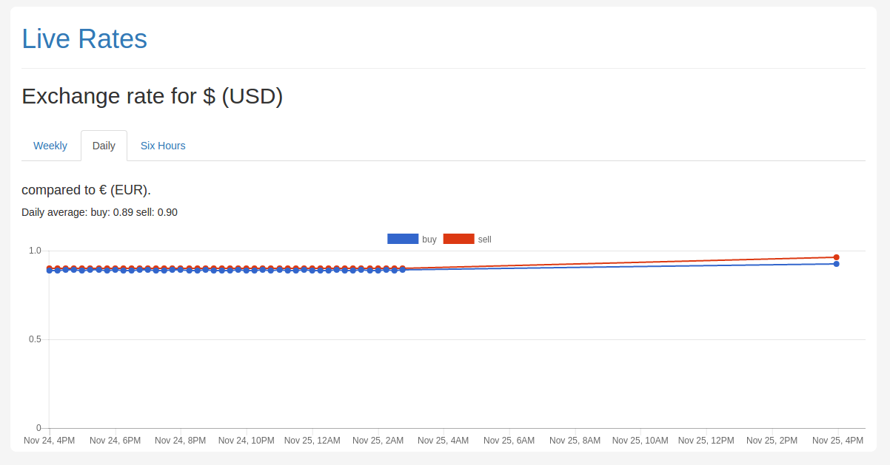

# Live rates
Example application of USD/EUR exchange rates viewer.
Stores rate dynamics with history.

# Screenshots


# Installation and running
You need docker and docker-compose to run the application.
Run:
```sh
docker-compose run web echo # installs everything for application
docker-compose up -d rate_updater # rate updater daemon running in background
docker-compose up web
```

# Development
To run ready to use test environment run:
```sh
docker-compose run test
```
